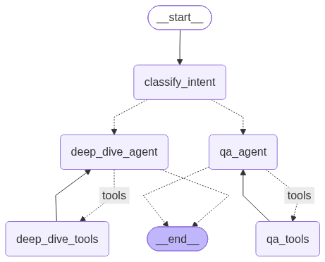

# Portfolio — AI Chatbot

An AI-powered portfolio website with a LangGraph-based chatbot agent that answers questions about my background, navigates the site, and can email my CV on request.

## Tech Stack

- **Frontend**: React (Next.js) + Tailwind CSS
- **Backend API**: Python (FastAPI)
- **AI/LLM**: Pluggable — supports OpenAI, Anthropic, or Google Gemini via user-provided API key
- **Email Service**: Resend
- **Hosting**: Self-hosted (Docker, Nginx)

## AI Agent Design



- **System Prompt** — stays on-topic (resume/work only), refuses roleplay or unrelated queries
- **Knowledge Base (RAG)** — local resume file with vector embeddings for offline Q&A
- **Function Calling / Tool Use** — tools for resume search, page navigation, email, and GitHub data

## Core Features

- **Q&A** over resume and LinkedIn (RAG + context)
- **Website navigation** — chatbot can scroll to any section
- **Email CV** with human-in-the-loop confirmation before send
- **Multi-node specialized agents**:
  - Q&A agent (resume, email, navigation)
  - Deep-dive agent (GitHub projects)
  - Router — re-classifies intent on every turn (no agent stickiness)
- **Session memory** via LangGraph checkpointer
- **Auth gate** (password or bring-your-own-key) enforced at FastAPI endpoint level, before LangGraph is invoked

## UX (HR-Focused)

- Quick to scan, optional to use
- Suggested prompts: *"Email me the CV"*, *"What are your core skills?"*, *"Summarize your AI experience."*
- Streaming responses via NDJSON

---

## Implementation Details

### 1. The Python Backend

#### Chat Endpoint — `/api/chat`

#### Agent Logic

- Configurable LLM provider
- System prompt enforces topic boundaries and cites knowledge base
- Router re-runs classification on every user message (no cached routing)

#### Tool Execution

| Tool | Agent | Notes |
|------|-------|-------|
| `search_resume` | Q&A | RAG over `resume-no-password.md` with Chroma vector store |
| `navigate_to_section` | Q&A | Scrolls page to a section via `document.querySelector` |
| `send_cv_email` | Q&A | Requires interrupt confirmation; max 5 emails/session |
| `get_github_repos` / `get_repo_details` | Deep-dive | Cached, with personal access token for higher rate limit |
| LinkedIn | Q&A | Offline markdown file (LinkedIn is too restrictive for live API) |

### 2. The React Frontend (Next.js)

#### UI Sections

- **Hero** — *"Hi, I'm Michael. I'm an AI Engineer specializing in Agents. Talk to my AI below, or scroll to see my work."*
- **Experience & Projects** — Comp Sci degree + AI projects, focused on impact
- **Tech Stack**
- **Chatbot UI**
  - Password-gated (password in CV, locked after 5 failed attempts)
  - Password unlocks a full session; without password, user provides their own API key
  - Rate-limited per session
  - Chat history in `sessionStorage` (frontend display) + LangGraph checkpointer (backend, in-memory, keyed by `thread_id`)
  - NDJSON streaming for actions and responses
- **Smooth Scroll** — uses `document.querySelector(data.target)` to scroll

### 3. Deployment & Production

- **API Security**: OTP password on CV for HR; others bring their own API key
- **Self-Hosting**: Docker + Nginx reverse proxy

---

## Phase 1 — Backend API & Agent (Progress)

- [x] Repository & environment setup
- [x] Local knowledge file (`resume-no-password.md`)
- [x] Tools (`tools.py`)
  - [x] `search_resume` — RAG with Chroma (PersistentClient), `MarkdownHeaderTextSplitter`, `sentence-transformers/all-MiniLM-L6-v2`
  - [x] `navigate_to_section`
  - [x] `send_cv_email` — email validation with `EmailStr`, retry 5x then log to SQLite, max 5/session
  - [x] `get_github_repos` / `get_repo_details` — TTL-based cache, 404 handling
- [x] LangGraph skeleton
  - ChatState (messages + route field)
  - Router node (re-classifies every turn)
  - Q&A agent node
  - Deep-dive agent node
  - Conditional edges
  - Interrupt checkpoint before email send
  - `MemorySaver` checkpointer keyed by `thread_id`
- [ ] FastAPI app & streaming protocol
- [ ] Auth gate (password + BYOK)

---

## Section IDs for Navigation

| ID | Maps To | Trigger Phrases |
|----|---------|-----------------|
| `hero` | Hero section | *"Take me to the top"*, *"Tell me more about you"* |
| `experience` | Experience section | *"Show me your work history, projects"* |
| `tech-stack` | Tech Stack section | *"What tools do you use?"* |
| `education` | Education section | *"Where did you study?"* |
| `contact` | Contact / CV area | *"How do I reach you?"* |

---

## Schemas

### GitHub Tools

```python
class RepoSummary(BaseModel):
    name: str
    description: str | None
    language: str | None
    stars: int
    url: str
    topics: list[str]
    updated_at: str

class RepoDetails(BaseModel):
    name: str
    description: str | None
    language: str | None
    languages_breakdown: dict[str, int]
    stars: int
    url: str
    topics: list[str]
    readme_excerpt: str  # first ~1500 chars
    updated_at: str
```

### Send CV Email

```python
from pydantic import BaseModel, EmailStr

class SendCvEmailInput(BaseModel):
    recipient_email: EmailStr
    recipient_name: str | None = None

class SendCvEmailConfirmation(BaseModel):
    recipient_email: EmailStr
    action: Literal["confirm", "cancel"]

class EmailSessionState(BaseModel):
    emails_sent_this_session: int = 0
    max_emails_per_session: int = 5

class SendCvEmailResult(BaseModel):
    status: Literal["sent", "failed_will_retry_log", "cancelled"]
    recipient_email: EmailStr
    message: str
```

### Failed Email Log (SQLite)

```sql
CREATE TABLE IF NOT EXISTS failed_email_log (
    id INTEGER PRIMARY KEY AUTOINCREMENT,
    recipient_email TEXT NOT NULL,
    user_prompt TEXT,
    thread_id TEXT,
    retry_count INTEGER NOT NULL DEFAULT 0,
    status TEXT NOT NULL DEFAULT 'pending',
    created_at TEXT NOT NULL,
    last_attempted_at TEXT NOT NULL,
    resolved_at TEXT
);
```
